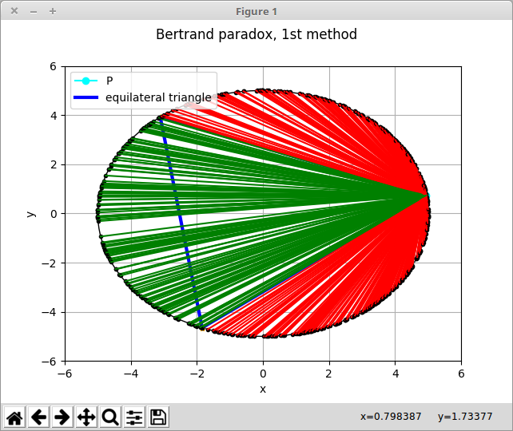
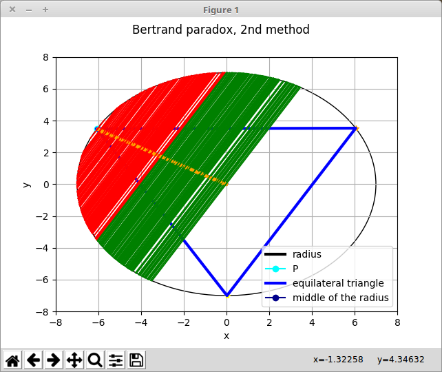
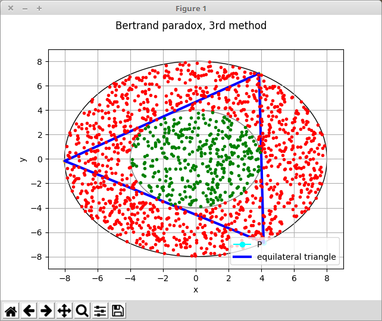
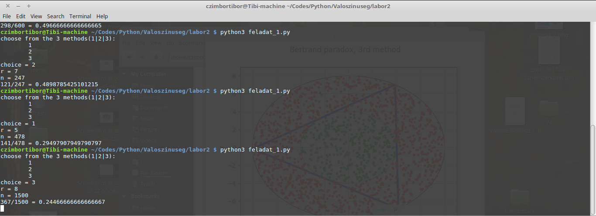

### Bertrand paradox
***

The Bertrand paradox probability problem: [wiki](https://en.wikipedia.org/wiki/Bertrand_paradox_(probability))

#### Dependencies
1. python 3.* [download](https://www.python.org/downloads/)
2. NumPy [download](http://www.scipy.org/scipylib/download.html)
3. Matplotlib [download](https://pypi.python.org/pypi/matplotlib)

or either the  [full SciPy stack](http://www.scipy.org/install.html) 
	for the libraries or a full python distribution [Anaconda python3 distribution](https://www.continuum.io/downloads)
***

#### plots
 

#### results

